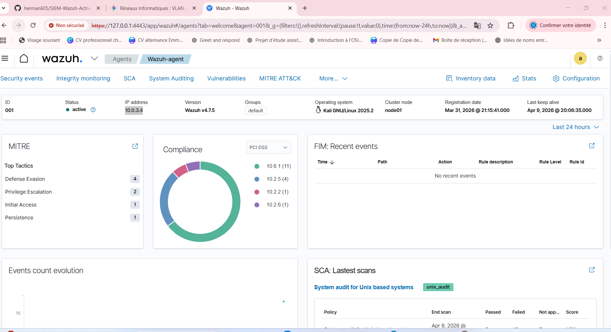
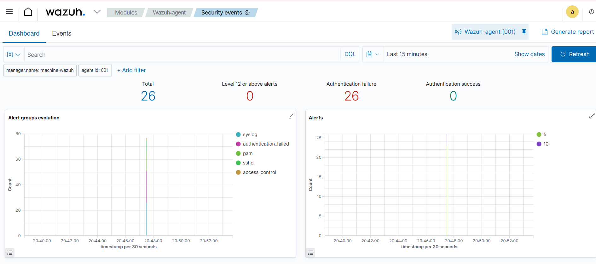
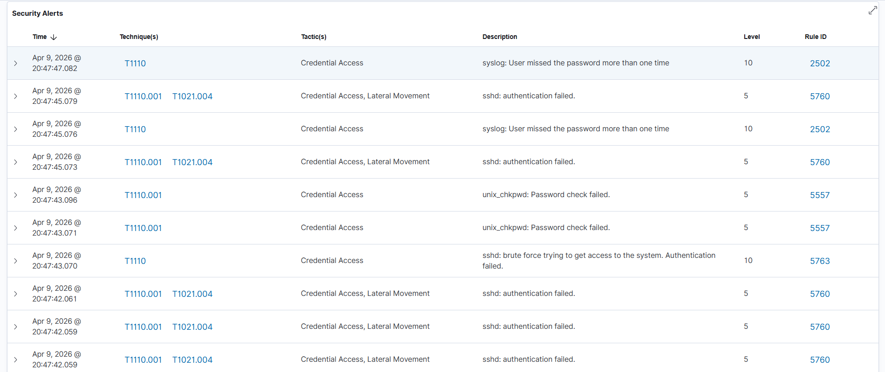
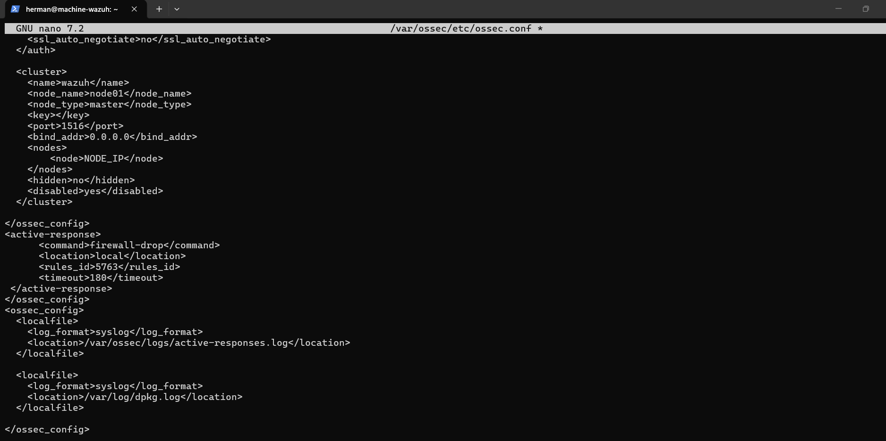
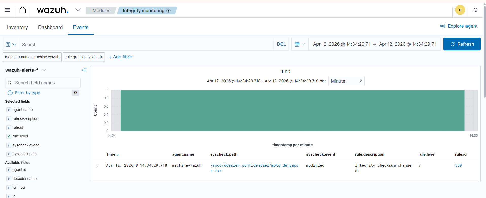
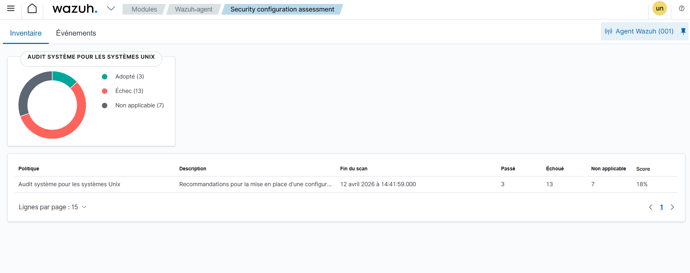

# Ingénierie SIEM : Wazuh & Active Response

## Objectif du Laboratoire
Ce projet documente la mise en place d'une infrastructure de détection et de réponse automatisée (Active Response) via le SIEM Wazuh. L'objectif principal est de sécuriser un point d'accès SSH contre les attaques par force brute en identifiant les angles morts des terminaux par défaut et en déployant des règles de corrélation XML sur mesure.

## Contexte Opérationnel (SOC)
Dans ce laboratoire, le travail de l'analyste s'articule autour de quatre piliers :
1. **Audit :** Évaluation des mécanismes de détection par défaut face à une attaque soutenue.
2. **Ingénierie de Détection :** Création d'une règle XML personnalisée exploitant la corrélation temporelle et spatiale.
3. **Tests de Résilience :** Contournement des sécurités internes et validation de la chaîne d'alerte via l'injection de journaux contrefaits (*Log Spoofing*).
4. **Automatisation (Blue Team) :** Déclenchement d'une isolation locale réseau ciblé.

## Architecture de Défense
* **Le Cerveau (Gérant) :** Serveur Wazuh assurant la détection, la corrélation et l'ordonnancement.
* **Le Bras Armé (Agent) :** Machine cible Linux chargée de l'exécution du blocage réseau (`firewall-drop`).

## Arborescence du Projet
* `/config` : Configuration de l'Active Response (`ossec.conf`).
* `/rules` : Règles XML de corrélation sur mesure (`local_rules.xml`).
* `/scripts` : Commandes d'investigation avancée et scripts de *Log Spoofing*.
* `/assets` : Preuves d'exécution, analyses de logs et Dashboard.

---

## 🛠️ Déploiement et Connectivité
* **Action :** Déploiement d'un serveur Wazuh Manager et installation d'agents sur des machines cibles (Kali Linux).
* **Résultat :** Visibilité totale sur le parc informatique avec une remontée des logs en temps réel.
> **Preuve de concept : Connexion réussie de l'agent**
> 

---

## ⚔️ Cas d'Usage 1 : Détection d'Attaque Brute-Force (SSH)
Pour tester l'efficacité des règles de détection, j'ai simulé une compromission d'accès.

* **Action (Red Team) :** Lancement d'une attaque par force brute sur le service SSH via l'outil `Hydra`.
> 

* **Résultat (Blue Team) :** Le SIEM a immédiatement intercepté les tentatives d'authentification échouées. Le tableau de bord affiche les pics d'alertes, catégorisés selon le framework **MITRE ATT&CK (T1110 - Credential Access)**.
> 
> 

---

## 🛡️ Cas d'Usage 2 : Remédiation Automatisée (Active Response)
Un SOC performant ne fait pas que détecter, il réagit.

* **Action :** Configuration du module *Active Response* dans `ossec.conf` pour déclencher une règle de blocage (`firewall-drop` de 180 secondes) dès que la règle de brute-force SSH (ID 5763) est déclenchée.
> 

* **Résultat :** Lors de l'attaque, Wazuh a automatiquement banni l'adresse IP source, stoppant l'intrusion sans intervention humaine. Les logs JSON confirment l'exécution de la commande `add` puis `delete` pour le blocage IP.
> 
> 

---

## ⚖️ Cas d'Usage 3 : Gouvernance, Risques et Conformité (GRC)
La cybersécurité inclut la protection des données sensibles et l'hygiène des systèmes, deux piliers des normes ISO 27001 et NIS2.

### A. File Integrity Monitoring (FIM)
* **Action :** Mise sous surveillance d'un fichier critique (`/root/dossier_confidentiel/mots_de_passe.txt`).
* **Résultat :** Détection immédiate d'une modification du checksum (Règle 550), garantissant la traçabilité des accès aux données sensibles.
> 

### B. Security Configuration Assessment (SCA)
* **Action :** Lancement d'un audit de configuration (SCA) sur le système Unix pour vérifier son durcissement.
* **Résultat :** Identification immédiate des failles de configuration (13 échecs détectés, score de 18%), permettant de générer un plan d'action de remédiation pour aligner le système sur les bonnes pratiques.
> 
